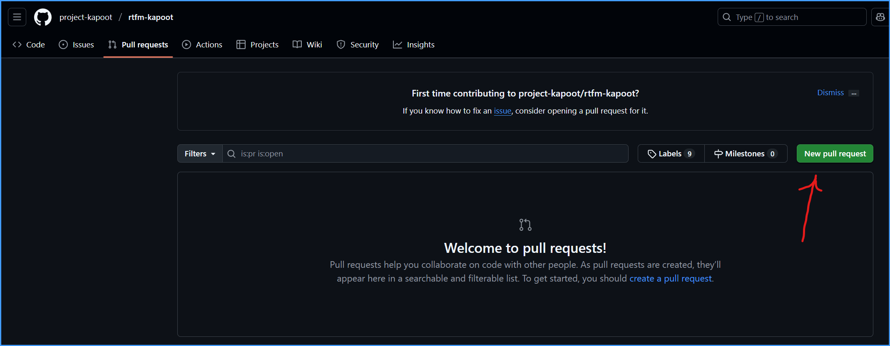
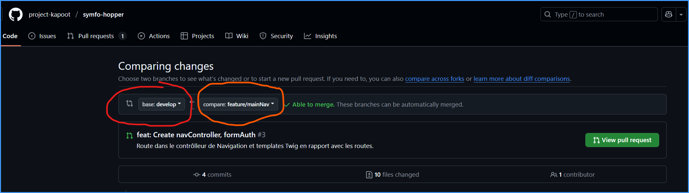
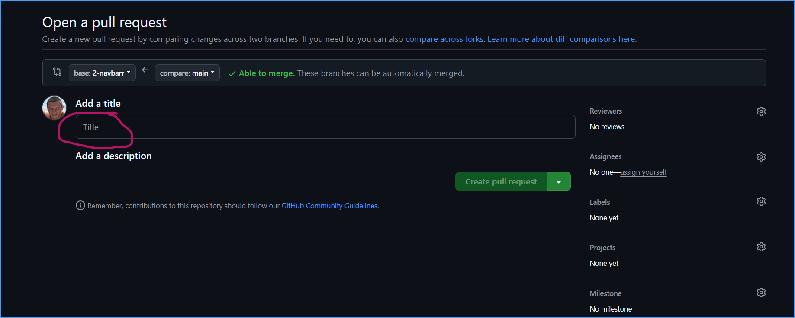

---

layout: default
---


# Procédure Git 

## Crée ça propre branche de fonctionnalité

1.  Placer vous sur la branche **develop** : `git checkout develop` (votre espace de travail doit être clean )
2.  Mettre a jour la branche **develop** : `git pull`
3.  Créer la nouvelle branche et changer de branche: `git checkout -b feature/<nomBranche>`

Vous pouvez bosser 😲

## Enregistrer ces modifications

1.  Mettre les modifications dans le stagging : `git add <modifiedFile>`
2.  Répéter l’étape 1, pour ajouter les modifications voulues dans le stagging ( zone de préparation avant commit )
3.  Créer le commit `git commit` et rédiger le message de commit avec votre éditeur

Vous pouvez continuer à bosser 😲

⚠️ Ne pas enregistrer des modifications sur la branche : **develop** ⚠️

## Envoyer ses modification sur le référentiel distant

1.  Après avoir bien travailler. envoyer via la commande `git push origin feature/<nameBranch>`

Vous avez mérité une pause 😎

## Mettre à jour sa branche par rapport à la dernière version de develop

1.  Mettre votre espace de travail au propre ( toutes modifications doivent être commités )
    
2.  Rester sur sa branche
    
3.  Entrer la commande suivante :
    
    `git pull origin develop`
    
    Par la suite, 2 cas de figures se présente à vous :
    
    1.  La fusion se passe bien ( Pas de conflits ) 🤗
        1.  Editer le message du commit de fusion est c’est réglé
    2.  La fusion se passe pas bien ( Conflits ) 💥
        1.  Ouvrer votre éditeur favoris et choisir la version à garder
            
        2.  Ensuite le mettre dans le stagging `git add nomFichier`
            
        3.  Faire un commit ( message prêt rempli avec `git commit` )
            
            ⚠️ _Attention au message est respecter la convention de nommage des messages commités_ ⚠️

## Mise à jour des branches remote en local par rapport au repository

```jsx
git remote update

```

-   ! Les branches local ne seront pas modifiés

## Crée une PR 


une pull request est une demande de fusion afin de demander l'autorisation de fusion sur une des branches protégé par le **git master**

pour crée une PR, aller dans l'interface _github_ et dans la page du projet, cliquer sur le bouton **New pull Request**

 

sélectionner votre branche, après avoir sélectionner votre, branche, vous arrivez sur page de comparaison, après avoir vérifié les comparaison. 
cliquer sur le bouton **Create Pull Request**

 

rédiger une description du code que vous avez crée, et des éventuellement des remarques pour **la code review** 

puis cliquer sur le bouton **create pull request**

 

ensuite vous pouvez prendre une bière est attendre que le code soit reviewer. 
